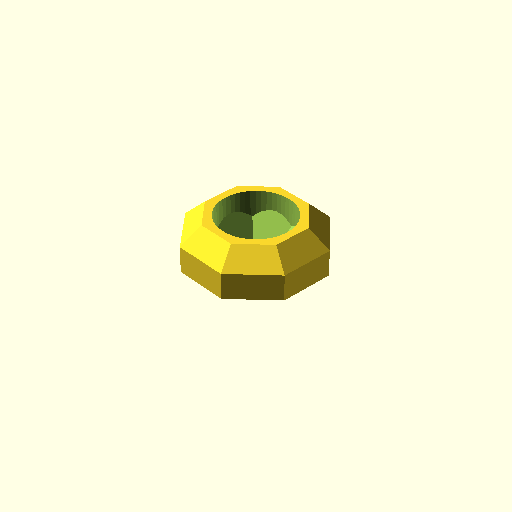
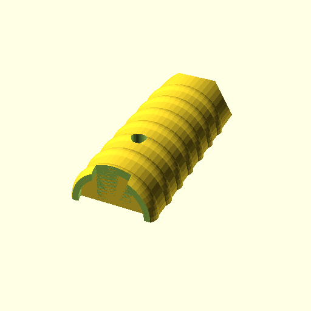

# Model painting helpers

I've tried a few helpers for holding minis while painting, but I were not
comfortable with them: some of them are complex and have many pieces
difficult to print, or they need screws, or they don't fit my bases. I'm
a batch painter that needs tens of helpers on the table, and I need them
to be simple to print and fast to operate. Moving pieces or screws are
not an option.

This simple model in thingiverse is nearly perfect:
<https://www.thingiverse.com/thing:3486254> (`thing:3486254`)
Unfortunately, it was designed for slim 25x2mm bases. My bases do not fit
very well, and other base dimensions are out of the question

This is the link to my bases: <https://github.com/Juanvvc/circular-bases>
And this is their:

- Height: 3mm
- Diameter: 25/32/40/50mm
- Horse bases are 50x30mm oval

I created some adapters for `thing:3486254` for 25mm, 32mm and 50mm bases.
I've been using these adapters and `thing:3486254` for months, and now 
it is time to create my own complete painting helper.

The models are OpenSCAD models and parametric. You can modify the dimensions
to fit your needs.

Models:

- **Type 3486254 adapters**: compatible with `thing:3486254`. You need
  adapters for every base size, and something to keep both halves of the
  handler together.
- **Custom adapters**: Not compatible with `thing:3486254`, but you
  don't need adapters for many 25mm bases. Not only for my bases, of course,
  but I've also tested many other 25mm bases including GW and some others.

In addition, there are:

- A tighter version of the handler base, which does not need any
  additional tool to hold the pieces together. Just insert the helper
  into the handler base and that's it. This tigh base is also
  comptatible with `thing:3486254`. It is rounded for better
  comfort in hand. This part cames with the helper when it is grabbed.
- Another version for the handler base in `thing:3486254`, a bit smaller
  than the original.  I feel the original takes too much space on my
  table, specially when I'm using 20 helpers at the same time! Notice
  this part remains on the table when you grab the painting helper.

None of these pieces need supports. This is why the top of the adapters
has a small gap. Also, there is a hole to insert an additional grip
helper that I honestly don't use, but you can use the one in `thing:3486254`.

The next image shows example with many of these pieces. The yellow parts
are `thing:3486254`, the black parts are these adapters. Notice that the
"not tigh" handler bases need some rubber bands to keep the two halves
together.

## Type 3486254 adapters

These adapters are designed to be used with the handler in
<https://www.thingiverse.com/thing:3486254> **They are not compatible with the
handlers in my project**.

Dimensions: 25/32/40/50mm circular bases and 30x50mm hose bases.
I've painted hundreds of miniatures using this configuration.

Use the adapters halves ortogonally to the handler halves. I recommend using a
rubber band to secure the two halves of the handler.

The base of the handlers is also compatible with `thing:3486254`. There
are two versions for this vase:

- **Tight**: fits very tight to the handler, you can use this base to secure
  the mode. It is round for better comfort when gripped.

- **Normal**: compatible with `thing:3486254`. It has a different shape to
  distinguish all types. You don't pick this base, it sits on the table
  while you paint the figures.

## Custom adapters

I created another version that does not need adapters for the 25mm bases and,
as a result, changing miniatures is significantly faster.

These adapters are not comptible with the handler in `thing:3486254`.
If you use these adapter, **you need my handler**.

Take into account that primming, painting and texturing the miniature base
can run the top part of the adapters. An adapter is cheaper and faster to print
than a whole handler, so consider using adapters even for 25mm bases if you
find your painting process is somehow "harsh" for the adapter.

You can use the **tight** and **normal** handler bases, and the small hole is
meant to be used with the optional handle in `thing:3486254`

This work (C) 2024 by Juan Vera is licensed under CC BY 4.0 