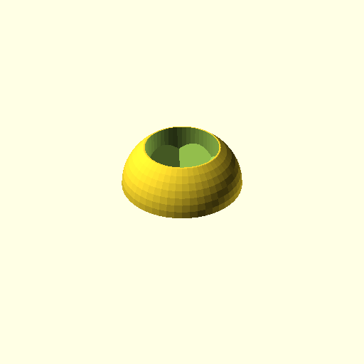

# Model printing handlers

I've tried some handlers in thingiverse, but I were not comfortable
with them they have many pieces, or they need screws, or they don't
fit my bases.

These are the dimensions for my bases:

- Height: 3mm
- Diameter: 25/32/40/50mm
- Horse bases are an oval 50x30mm

This simple model is nearly perfect, but it does not fit my bases: 
<https://www.thingiverse.com/thing:3486254> (`thing:3486254`)

As a result, I've created some adapters for the handler for 25mm, 32mm
and 50mm bases, and some variations of the handler and the base.

The model are OpenSCAD modes and parametric, and you can modify
the dimensions to some extend to fit your needs.

Models:

- **Type 3486254 adapters**: compatible with `thing:3486254`
- **Custom adapters**: Not compatible with `thing:3486254`, but you don't need adapters for 25mm bases

None of these pieces need supports.

All these adapters are compatible with my bases.

## Type 3486254 adapters

The are compatible with <https://www.thingiverse.com/thing:3486254>

All the "type 3486254 adapters": 25/32/40/50mm bases. Print the handle
and base in <https://www.thingiverse.com/thing:3486254>.
I've painted hundreds of miniatures using this configuration.

Use the adapters ortogonally to the handler halves. The models can hold
without any other pieces, but I recommend a rubber to really secure the
two halves of the handler.

## Custom adapters

I created another version that does not need adapters for the 25mm bases and as a result, chaging miniatures is significantly faster.

However, these adapters are not comptible with the handler in thing:3486254

Take into account that primming, weathering and texturing the base
can make the adapters unusable. An adapter is cheaper and faster to print
than a whole handler, so consider using adapters even for 25mm bases if you
find your creative process is somehow "dirty".

The custom handler is only compatible with the custom adapters, not the 3486254 type.

Two versions for the base handler:

- Tight: fits very tight to the handler, you can use this base to secure
  the mode. It is round for better comfort when handled.

- Normal: compatible with `thing:3486254`. It has a different shape to
  distinguish all types. You don't pick this base, it sits on the table
  while you paint the figures.

This work (C) 2024 by Juan Vera is licensed under CC BY 4.0 